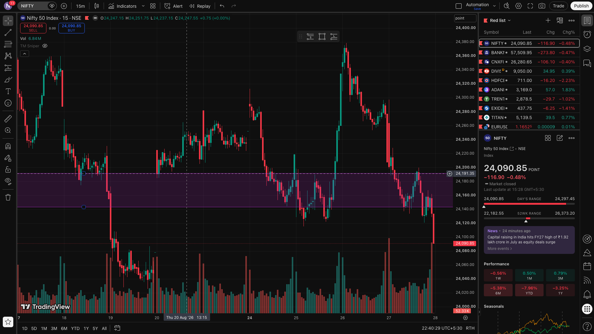
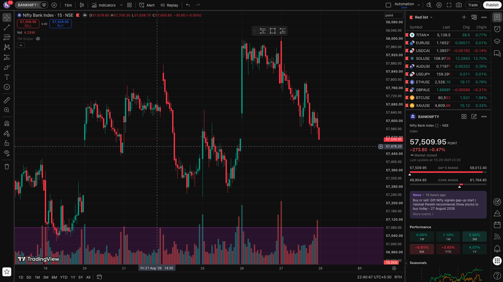
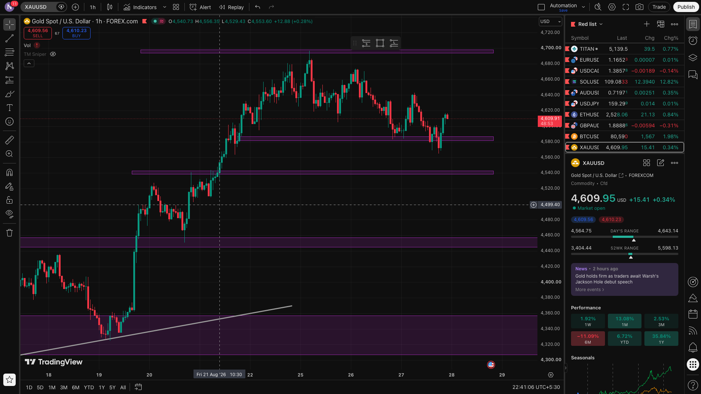

# 📈 Financial Market Chart Automation & Telegram Alert System

[](https://www.python.org/)
[](https://playwright.dev/)
[](https://github.com/features/actions)
[](https://core.telegram.org/bots/api)
[](LICENSE)

An automated market intelligence pipeline built with **Python**, **Playwright**, and **GitHub Actions**. It autonomously captures high-resolution technical charts from **TradingView** (with custom indicators and layouts) and dispatches formatted alerts directly to **Telegram** channels and groups.

---

## 📸 Sample Chart Broadcasts

| NIFTY 50 (15M) | BANK NIFTY (15M) | GOLD / XAUUSD (1H) |
| :---: | :---: | :---: |
|  |  |  |

---

## ✨ Key Features

- **Multi-Asset & Multi-Timeframe Coverage:** Pre-configured support for NSE Indices (NIFTY 50, BANK NIFTY), Commodities (Gold, Silver, US Crude Oil), and Forex instruments.
- **Headless Stealth Browser Automation:** Uses Playwright with custom anti-bot evasion techniques (`--disable-blink-features=AutomationControlled`, navigator webdriver masking, and canvas recalculation).
- **Authenticated Layout & Indicator Persistence:** Saves and loads encrypted TradingView user session state (`auth_state.json`), enabling automated capture of private indicator layouts, saved drawing levels, and dark mode themes.
- **Intelligent Holiday & Weekend Detection:** Real-time integration with the **NSE India Holiday API** and IST timezone validation to prevent execution on market holidays and weekends.
- **Multi-Channel Telegram Broadcast:** Dispatches compressed high-resolution images with rich Markdown-formatted metadata (date, timeframe, ticker) to multiple chat IDs simultaneously.
- **Cloud CI/CD Ready:** Scheduled and manual workflow orchestration via **GitHub Actions** with encrypted secrets management.

---

## 🛠️ Tech Stack

- **Core:** Python 3.10+
- **Browser Automation:** [Playwright for Python](https://playwright.dev/python/)
- **HTTP / REST Client:** [Requests](https://requests.readthedocs.io/)
- **CI/CD & Scheduling:** GitHub Actions
- **Alerting:** Telegram Bot API

---

## 📁 Repository Structure

```text
├── .github/workflows/
│   └── daily_automation.yml  # GitHub Actions workflow definition
├── screenshots/              # Sample generated chart outputs
│   ├── nifty_15m_chart.png
│   ├── banknifty_15m_chart.png
│   └── xauusd_1h_chart.png
├── .env.example              # Environment variables template
├── .gitignore                # Git ignore rules for secrets and temp files
├── requirements.txt          # Python dependencies
├── run_automation.py         # Main execution pipeline
└── save_auth.py              # CLI helper to capture & save TradingView session
```

---

## 🚀 Getting Started

### 1. Clone the Repository
```bash
git clone https://github.com/Neel209/Telegram_automation.git
cd Telegram_automation
```

### 2. Create and Activate a Virtual Environment
```bash
python3 -m venv venv
source venv/bin/activate   # On Windows: venv\Scripts\activate
```

### 3. Install Dependencies
```bash
pip install -r requirements.txt
playwright install chromium
```

### 4. Configure Environment Variables
Copy `.env.example` to `.env` and fill in your details:
```bash
cp .env.example .env
```

| Variable | Description |
| :--- | :--- |
| `TELEGRAM_BOT_TOKEN` | Token generated from [@BotFather](https://t.me/botfather) |
| `TELEGRAM_CHAT_ID` | Telegram chat ID(s) or channel IDs (comma-separated for multiple channels) |
| `TRADINGVIEW_LAYOUT_ID` | *(Optional)* Your personal TradingView layout ID from the URL |
| `TEST_MODE` | Set to `true` to capture charts locally without sending Telegram messages |

---

## 🔐 Session Authentication Setup (Optional for Custom Layouts)

To capture charts with your personal indicators and drawings:
1. Run the session saver script:
   ```bash
   python save_auth.py
   ```
2. A Chromium browser window will open. Log in to your TradingView account.
3. Once logged in, return to your terminal and press `[ENTER]`.
4. Your session state will be saved to `auth_state.json` (which is git-ignored for security).

---

## ☁️ GitHub Actions Cloud Deployment

To run this on GitHub Actions automatically:
1. Go to your GitHub repository -> **Settings** -> **Secrets and variables** -> **Actions**.
2. Add the following repository secrets:
   - `TELEGRAM_BOT_TOKEN`: Your bot token.
   - `TELEGRAM_CHAT_ID`: Your chat or channel ID.
   - `PLAYWRIGHT_AUTH_STATE`: *(Optional)* The JSON string content of your `auth_state.json` file.
   - `TRADINGVIEW_LAYOUT_ID`: *(Optional)* Your layout ID.
3. Trigger the workflow manually under the **Actions** tab or schedule it via cron.

---

## 📄 License

This project is licensed under the MIT License - see the [LICENSE](LICENSE) file for details.
